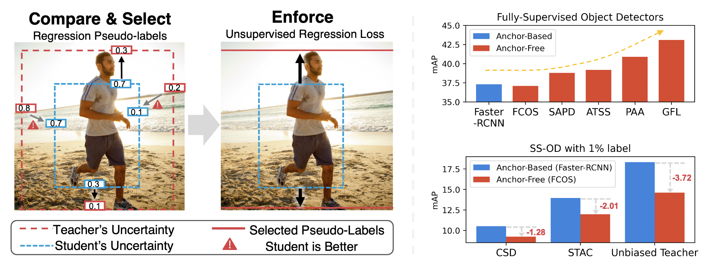

# Unbiased Teacher v2: Semi-supervised Object Detection for Anchor-free and Anchor-based Detectors

 [](https://opensource.org/licenses/MIT)

This is Chao Lab's implementation of <br>
**Unbiased Teacher v2: Semi-supervised Object Detection for Anchor-free and Anchor-based Detectors**<br>
[Yen-Cheng Liu](https://ycliu93.github.io/), [Chih-Yao Ma](https://chihyaoma.github.io/), [Zsolt Kira](https://www.cc.gatech.edu/~zk15/)<br>
The IEEE / CVF Computer Vision and Pattern Recognition Conference (CVPR), 2022 <br>

[[Paper](https://openaccess.thecvf.com/content/CVPR2022/papers/Liu_Unbiased_Teacher_v2_Semi-Supervised_Object_Detection_for_Anchor-Free_and_Anchor-Based_CVPR_2022_paper.pdf)] [[Project](https://ycliu93.github.io/projects/unbiasedteacher2.html)]

<p align="center">

</p>

## Setup
1. Create a conda environment with python==3.9
2. Install all dependencies from requirements.txt -- note that OpenSlide may conflict with other slide reading packages

## Dataset
### Directory structure
Training on multiple datasets is supported, so long as they are nested under the same parent directory. These datasets can be labeled or unlabeled. 
However, each image requires an annotation file to be provided, even if it is unlabeled (see Annotation format section for more details).
For each dataset, annotation files should be nested in a subdirectory named "tissue_annotations" at the same level as the images.
(See Config section for more details). For example,
```
<data_dir>/
    <image_file_1>.npy
    <image_file_2>.npy
    ...
    <'tissue_annotations'>/
        <image_file_1>.json
        <image_file_2>.json
    ...
```
### Dataset format
The image data and annotations are expected to share the same base name.
Images can be in numpy format ".npy" or in standard PIL-compatible image formats ".jpg", ".png". Annotations must be in json format.
Since unlabeled proposals are generated as boxes, only box annotations are supported (see Annotation format section for more details).

### Annotation format
The detectron2 standard annotation dictionary format is followed. An additional "labeled" field is added to differentiate labeled vs. unlabeled.
This field is useful since images with no labels of interest can still be labeled (i.e. the absence of labels does not imply the omission of labels).
For example,

{
    "file_name": "/path/to/image.npy",
    "width": x,
    "height": y,
    "labeled": "z"
    "annotations": [
        {
            "category_id" : 0,
            "bbox" : [
                x1,
                y1,
                x2,
                y2
            ],
            "bbox_mode": 0
        },
        ...
    ]
)

Where x, y are integers and z is True or False and annotations is a list of dicts.

## Training
### Basic command-line

python train_net3.py \
--config-file <path_to_config_file>

### Config

Note: any unspecified config fields will automatically inherit COCO defaults which may cause unintended consequences
View output/config.yaml to see the FULL config of a given training run

The following .yaml block gives descriptions of our implementation-specific params. For more information consult detectron2 config docs.

```yaml
# UBTeacherV2 Main Branch Config Params.
_BASE_: "../Base-RCNN-FPN.yaml" # Inherits detectron2 model config. Make sure path is correct.
MODEL:
    META_ARCHITECTURE: "TwoStagePseudoLabGeneralizedRCNN" # Altered from original UBTeacherV2 for our purposes
    WEIGHTS: "detectron2://ImageNetPretrained/MSRA/R-50.pkl" # Supports .pth and .pkl to load pre-training
    PROPOSAL_GENERATOR:
        NAME: "PseudoLabRPN" # Unchanged fromm UBTeacherV2
ROI_HEADS:
    NAME: "StandardROIHeadsPseudoLab" # To match META_ARCHITECTURE
    LOSS: "FocalLoss_BoundaryVar" # Focal loss is key for "unbiased" classifications
    NUM_CLASSES: 4 # N + 1 classes, originally 80 for COCO training
SOLVER:
    IMG_PER_BATCH_LABEL: 10 # Must be non-zero always
    IMG_PER_BATCH_UNLABEL: 10 # Must be non-zero if using semi-supervised
    BASE_LR: 0.01
    MAX_ITER: 10000
DATALOADER:
  SUP_PERCENT: 100.0 # For most applications, we do not wish to withhold labels
  FILTER_EMPTY_ANNOTATIONS: False # Lack of anno. doesn't necessarily mean unlabeled in our use-case.
DATASETS:
  CROSS_DATASET: True # Semi-supervision
  TRAIN_LABEL: ("train_labeled",) # train_net3 uses this naming convention. 
  TRAIN_UNLABEL: ("train_unlabeled",) # see above
  TEST: ("val",) # see above
SEMISUPNET:
  Trainer: "ubteacher_rcnn" # only RCNN is supported for semi-supervised currently

# Note: If cfg.SEMISUPNET.Trainer is not "ubteacher_rcnn", the ubteacher v1 BaselineTrainer will be used.
# This does not support semi-supervision and requires cfg.DATASETS.CROSS_DATASET as "False". 

# New Params. - These ALL require specification!
NUMPY: True # Determines whether .npy or .jpg/.png is expected to control image loader
IMG_DIR: /mnt/d/labeled_images # Path to parent directory as described in README
TRAIN_FRACTION: 0.8 # Allocates a certain percentage for train-time validation
REGISTER: True # Choose your own dataset or use a COCO default in TRAIN_LABEL/UNLABEL/TEST
CLASS_CONVERTER: /mnt/d/class_conversions/neoplastic.json # Path to a json with a dict. See class section below
CAT_MAP: {"0" : "class_0", "1" : "class_1", ...} # See class section below
DEBUG: False # If True, floods a folder with sample training images at train time - Use with caution!!!
```

## Annotation Preprocessing
### Overview
This script is designed to create ground truths for training a machine learning model for unbiased teacher applications in pathology image analysis. It processes both labeled and unlabeled data, ensuring every image receives appropriate annotations. The script handles various image formats, annotations, and allows for customization through command-line arguments.
### Features
- Processes whole-slide images (WSIs) in .tif or .svs formats.
- Extracts tissue regions and corresponding annotations from images.
- Converts annotations into condensed manageable classes (e.g., neoplastic, non-neoplastic, ignore).
- Automatically detects annotation folders.
- Includes support for tissue masking and scaling bounding boxes.
- Visualizes and saves cropped tissue regions.
- Provides options for lesion or tissue-based processing.
### Installation
#### Dependencies
Ensure the following Pyhton libraries are installed:
- `numpy`
- `tifffile`
- `matplotlib`
- `detectron2`
- `openslide-python`
- `Pillow`

Install dependencies using pip:
```
pip install numpy tifffile matplotlib detectron2 openslide-python pillow
```
### Usage
Run the script using the following syntax:
```aiignore
python annotation_preprocessing.py <src_dir> <out_dir> [--qupath_annos <path>] [--tissue_json <path>] [--mode <lesion_finder|tissue_finder>] [--label <label>] [--tissue_mask <True|False>] [--cat_map <path>]
```
#### Command-Line Arguments
Below is a detailed structure of command-line arguments defined in the script:
```aiignore
parser = argparse.ArgumentParser(description='Get the input arguments')
parser.add_argument(
    'src_dir', 
    type=str, 
    help='The source directory containing the images'
)
parser.add_argument(
    'out_dir', 
    type=str, 
    help='The output directory to save the processed images'
)
parser.add_argument(
    '--qupath_annos',
    type=str,
    default=None,
    help='(Optional) The directory containing the QuPath annotations. '
         'If not provided, auto-detection will be used.'
)
parser.add_argument(
    '--tissue_json',
    type=str, 
    default='configs/class_conversions/tissues.json',
    help='Path to a JSON file containing valid tissue types. Default is '
         'configs/class_conversions/tissues.json.'
)
parser.add_argument(
    '--mode',
    type=str,
    default='lesion_finder',
    choices=['lesion_finder', 'tissue_finder'],
    help='Mode to run the script: "lesion_finder" for the original cropping approach, '
         '"tissue_finder" for a single WSI image with tissue boxes.'
)
parser.add_argument(
    '--label',
    type=str,
    default='neoplastic',
    help='The label to use for the annotations, default is neoplastic'
)
parser.add_argument(
    '--tissue_mask',
    type=bool,
    default=False,
    help='Boolean to indicate if tissue masking is needed'
)
parser.add_argument(
    '--cat_map',
    type=str,
    default='',
    help='Path to a cat_map JSON for category mapping. If empty, defaults are used.'
)
args = parser.parse_args()
```
### Required Arguments
- `src_dir`: Directory containing the input images.
- `out_dir`: Directory to save the processed outputs.
### Optional Arguments
- `--qupath_annos`: Path to the directory containing QuPath annotations. If not provided, the script attempts auto-detection.
- `--tissue_json`: Path to a JSON file defining valid tissue types Default: `configs/class_conversions/tissues.json`.
- `--mode`: Processing mode: `lesion_finder` (default) or `tissue_finder`
- `--label`: Lable to filter annotations. Default: `neoplastic`.
- `--tissue_mask`: Boolean indicating if tissue masking is needed.
#### Example
`python annotation_preprocessing.py /path/to/images /path/to/output --qupath_annos /path/to/annotations --mode lesion_finder --label neoplastic`
### Output
The script generates the following outputs in the specified `out_dir`:
- Cropped tissue regions saves as `.npy` files.
- Annotations saved as `.json` files under `tissue_annotations/`
- Visualizations saved as `.png` files under `visualizations`


### Using the Class Converter

- Sometimes classes are overly informative for training
- We want to condense the classes for training to avoid 400 different classes with 3 images each
- Dict. will be flipped and values mapper back to keys. Annos. will be registered with keys as the class.

```yaml
{"key1" : ["value1", "value2", "value3", "value4"], "key2": ["value5", "value6"]}
```

### Numpy vs. Jpg/Png

- Our implementation uses numpy inputs but we retain support for the COCO standard image formats
- cfg.NUMPY controls the following:
```python
# In ubteacher/data/dataset_mapper.py and in BaselineTrainer's DatasetMapperTwoCropSeparateV1 (not currently used)

if self.isnumpy:
  image = np.load(dataset_dict["file_name"])

if self.isnumpy:
  if "sem_seg_file_name" in dataset_dict:
  sem_seg_gt = np.load(dataset_dict.pop("sem_seg_file_name"))

# Otherwise, default detectron2 read_image is used
```


This project is licensed under [MIT License](LICENSE), as found in the LICENSE file.
